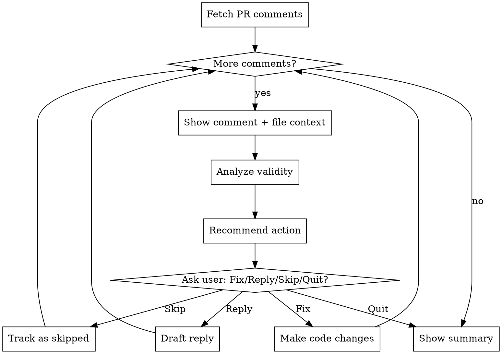

# Address PR Review Comments

## Overview

Interactive workflow: analyze PR review comment validity, recommend action, let user decide (fix/reply/skip).

## When to Use

- PR has review comments needing evaluation before action
- Reviewer feedback might be incorrect or needs discussion
- Comments require varied responses (fix/reply/skip)
- Need to balance code quality with respectful reviewer engagement

## When NOT to Use

- All comments are clearly valid and straightforward to fix
- No comments yet or doing pre-review self-review
- Comments only on non-code files without technical analysis needed

## Workflow Overview



## Fetching Comments

**CRITICAL**: Do NOT use `gh api --jq` directly - it truncates comment bodies.

Use the included script:

```bash
# summary with counts and titles
python .claude/skills/address-pr-review/scripts/fetch_comments.py <PR> --summary

# show unresolved comments (default)
python .claude/skills/address-pr-review/scripts/fetch_comments.py <PR>

# single comment by ID
python .claude/skills/address-pr-review/scripts/fetch_comments.py <PR> --id <ID>

# all comments including resolved
python .claude/skills/address-pr-review/scripts/fetch_comments.py <PR> --all
```

## Quick Reference

**Critical principle:** Reviewer may be wrong - analyze validity before recommending action.

| Phase | Actions |
|-------|---------|
| **Fetch** | Run `--summary` first to see counts<br>Then `--id <ID>` for each comment to analyze<br>Exit if no unresolved comments |
| **Per Comment** | Show: file:line, author, comment, ±10 lines context<br>Analyze: Valid/Nitpick/Disagree/Question<br>Recommend: Fix/Reply/Skip with reasoning |
| **Fix** | Minimal changes per llm/rules-*.md<br>Offer reply draft: `Fixed: [what]. [why]`<br>Show: `gh api --method POST repos/{owner}/{repo}/pulls/comments/$ID/replies -f body="..."` |
| **Reply** | Draft based on type: Question/Suggestion/Disagreement<br>Let user edit<br>Show gh command (never auto-post) |
| **Summary** | Processed X/N: Fixed Y, Replied Z, Skipped W<br>List: files modified, reply drafts, next steps |

## Critical Principles

| Principle | Violation Pattern |
|-----------|-------------------|
| **Analyze first** | Accepting all feedback as valid without critical analysis |
| **Never auto-post** | Posting replies automatically instead of showing gh command |
| **One at a time** | Batch processing all comments without individual analysis |
| **Show context** | Making changes without displaying ±10 lines around code |
| **Minimal changes** | Large refactors in response to small comments |
| **Follow standards** | Ignoring llm/rules-*.md when fixing |
| **Respectful honesty** | Being defensive/dismissive when reviewer is wrong |
| **User control** | Posting drafts without letting user edit first |

## Reply Formats

- Fix: `Fixed: [what]. [why]`
- Update: `Updated: [what]`
- Answer: `[explanation]`
- Acknowledge: `Good catch, [action/reason]`
- Disagree: `[respectful reasoning]`

## Setup & Usage

Requires: `gh` CLI authenticated, GitHub remote configured

```bash
# Start session
"use address-pr-review for PR <number>"

# Or list PRs first
"use address-pr-review"
```
